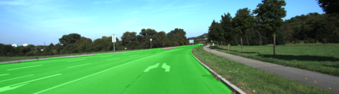
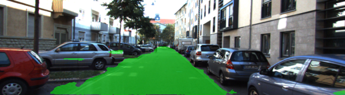
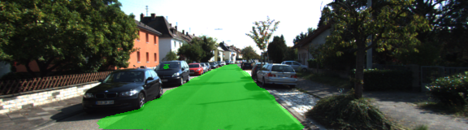
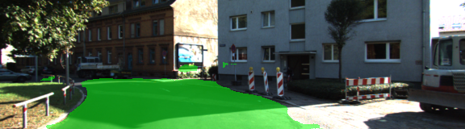
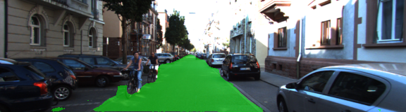

# Term3_Proj2_Semantic_Segmentation
Using FCN (VGG16) for Semantic Segmentation

The target of this project is: label the pixels of a road in images using a Fully Convolutional Network (FCN).

## Important Reference

VGG16 FCN: https://people.eecs.berkeley.edu/~jonlong/long_shelhamer_fcn.pdf
Most contents of this project has been covered in this paper

Udacity Self-driving car term 1 lesson 7, very helpful to review tensorflow

## Result

